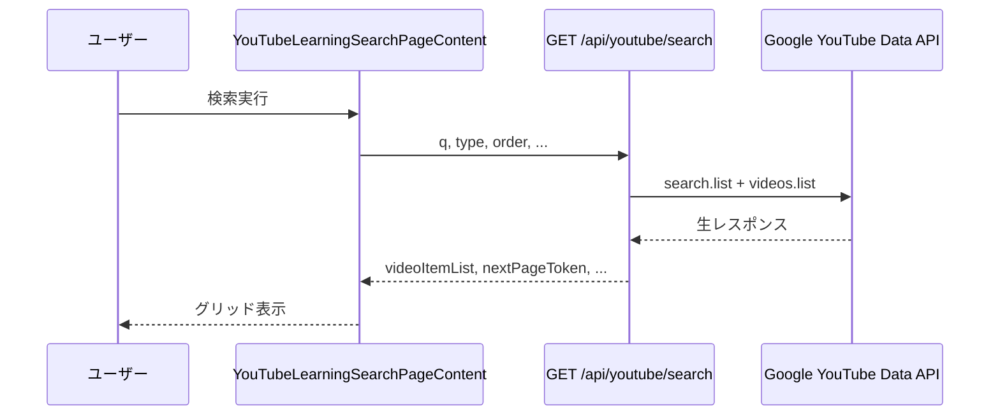
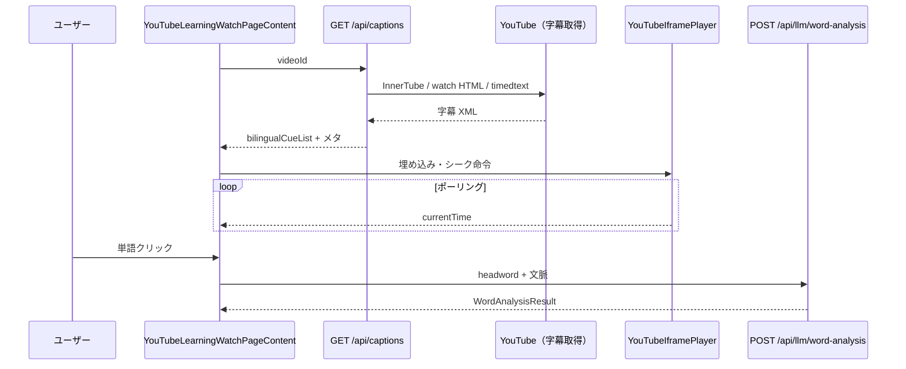

# 設計書（MVP / 現行実装）

> **若手エンジニア向け：まず読む順番**  
> 1. この文書の「1. アーキテクチャ概要」  
> 2. 「2. リクエストの流れ」（検索・視聴の 2 本）  
> 3. 「3. 字幕パイプライン」（最も複雑なので図つき）  
> 4. 必要に応じて「4. コンポーネント責務」  
> その後、実装を追うときは [仕様書.md](./仕様書.md) の「7. ディレクトリとファイル一覧」を開きながらファイルを開くと迷いにくいです。

---

## 1. アーキテクチャ概要

### 1.1 レイヤ構造

```
[ブラウザ]
   │  ページ遷移・React UI
   ▼
[Next.js サーバー]
   │  Route Handlers（/api/*）… ここだけが API キーを触れる
   ▼
[外部]
   YouTube Data API / YouTube 本体（字幕・IFrame）/ OpenAI 互換 API / （任意）翻訳 API
```

**設計原則**

- **秘密情報（API キー）はクライアントに出さない。** ブラウザからは常に自前の `/api/...` を叩く。  
- **ドメインロジック**は可能な限り `src/lib/**` に置き、`route.ts` は「検証・呼び出し・HTTP ステータス」の薄い層にする。  
- **型**は `src/types/youtubeEnglishLearningViewer.ts` を正とし、API の JSON と揃える意識で書く。

### 1.2 「クライアント」と「サーバー」の境界

| 場所 | 実行環境 | 典型処理 |
|------|----------|----------|
| `src/app/page.tsx` など（デフォルトは Server Component だが、本プロジェクトの検索・視聴は `"use client"` コンテナ） | ブラウザ | `fetch('/api/...')`、React state |
| `src/app/api/**/route.ts` | Node（サーバー） | `process.env`、YouTube へ `fetch` |

検索・視聴のメイン UI は **`"use client"`** の大きなコンテナコンポーネント（`YouTubeLearningSearchPageContent` / `YouTubeLearningWatchPageContent`）に集約されている。

---

## 2. リクエストの流れ

### 2.1 検索（トップページ）



**ポイント**

- 初回マウント時に **既定クエリ「TED」** で自動検索する（`useEffect` 空依存）。  
- `videoId` の重複はクライアント側で除去し、React の `key` 安定性に配慮している。  
- ページ追加時は `pageToken` を付けて同じ API を再度呼ぶ。

### 2.2 視聴ページ



**ポイント**

- **再生位置**は IFrame API の `getCurrentTime` を一定間隔で読み、`findActiveBilingualCueIndex` で現在行を決める（`NEXT_PUBLIC_SUBTITLE_PLAYBACK_SYNC_LAG_SECONDS` で `時刻 − ラグ` を調整。正で遅れ、負で進む。既定 -0.35）。  
- **シーク**は親が `seekCommand` state を更新し、子プレイヤーが `seekTo` を実行するパターン。  
- レイアウトは **ビューポート高で固定**し、全文スクリプトだけ内部スクロール（`scrollIntoView` は使わずコンテナの `scrollTo`）。

---

## 3. 字幕パイプライン（`/api/captions` の設計）

ここが最も分岐が多い。**上から順に「取れたらそれを使う」**のではなく、**経路ごとに英語・日本語の候補を出し、最後にマージする**イメージで読むと理解しやすい。

### 3.1 高レベルフロー

```mermaid
flowchart TD
  A[GET /api/captions] --> B[InnerTube ANDROID player]
  A --> C[watch ページ ytInitialPlayerResponse]
  B --> D[英語 XML 候補]
  B --> E[日本語 XML 候補]
  C --> D
  C --> E
  D --> F{英語まだ無い?}
  F -->|はい| G[timedtext 言語フォールバック en...]
  F -->|いいえ| H[日本語の優先マージ]
  G --> H
  H --> I[ネイティブ日本語を自動翻訳より優先]
  I --> J{日本語なし & 英語あり?}
  J -->|はい| K[timedtext tlang=ja]
  J -->|いいえ| L[パース → TranscriptCue[]]
  K --> L
  L --> M[buildBilingualTranscriptCueList]
  M --> N{環境変数で MT?}
  N -->|はい| O[欠損行だけ Google / Libre]
  N -->|いいえ| P[JSON 返却]
  O --> P
```

### 3.2 日本語ソースの優先（ネイティブ vs YouTube 自動翻訳）

`selectPreferredJapaneseCaptionFetchResult`（`route.ts` 内）の役割:

- InnerTube / 視聴ページ / timedtext ネイティブの **3 候補**から、  
- **`isAcquiredViaYoutubeAutoTranslation` が付いていない（= ネイティブ扱い）を最優先**。  
- どれもネイティブでなければ、先に取れた自動翻訳を採用。

その後、**まだ日本語が無く英語だけある**場合に `fetchYouTubeTimedTextJapaneseXmlViaYoutubeAutoTranslationParameter`（`lang` + `tlang=ja`）を試す。

### 3.3 英日マージ（`buildBilingualTranscriptCueListFromSeparateTracks`）

- **基準軸は英語**（英語の各行に対して日本語を 1 行選ぶ）。  
- まず **時間重なりスコア**（区間が「すれ違い」だけのときは微小ギャップを許容）。  
- 足りなければ **中点時刻が近い**日本語行をフォールバック（最大距離あり）。  
- **日本語行の「占有」はしない**（1 つの日本語が複数の英語行に対応しうる）。  

### 3.4 機械翻訳フォールバック（ローカル NLLB・API キー不要）

- **対象:** `missingJapanese === true` かつ `englishText` が空でない行だけ。  
- **実装:** `@xenova/transformers` の `pipeline('translation', 'Xenova/nllb-200-distilled-600M')` で **eng_Latn → jpn_Jpan**（英語学習向けの英→日前提）。  
- **無効化:** `DISABLE_LOCAL_NLLB_SUBTITLE_TRANSLATION` が `true` / `1` のときは補完を**スキップ**する。  
- **日本語トラック 0 行:** YouTube 側で日本語が 1 行も取れないと全行が欠損扱いになり全文逐次翻訳となりタイムアウトしうるため、**既定では NLLB をスキップ**し英語のみ返す。全文をローカル翻訳する場合のみ `ENABLE_LOCAL_NLLB_FOR_ENGLISH_ONLY_TRANSCRIPTS` を有効にする。  
- **失敗時:** 例外を握りつぶし、**元の `bilingualCueList` のまま**返す。サーバーに `console.error` で概要を出す。  
- **API 応答:** `japaneseMachineTranslationProvider` で `local_nllb` / `null` を区別。  
- **詳細:** [ローカル字幕翻訳_NLLB.md](./ローカル字幕翻訳_NLLB.md)

---

## 4. コンポーネント責務（視聴）

| コンポーネント | 保持する state の例 | 子へ渡すもの |
|----------------|---------------------|--------------|
| `YouTubeLearningWatchPageContent` | `bilingualCueList`, 再生関連, 単語解析結果, 各種フラグ | プレイヤー・オーバーレイ・スクリプト・解析パネル |
| `YouTubeIframePlayer` | IFrame API 準備完了など | `onCurrentPlaybackTimeSeconds`, `seekCommand` を消費 |
| `SubtitleOverlayPanel` | ほぼなし（表示） | `activeCue`, 表示モード |
| `TranscriptScriptPane` | スクロールコンテナ ref | 行クリック → 親のシーク |
| `WordAnalysisSidePanel` | なし | 親から結果を表示のみ |

---

## 5. 拡張・改修するときの注意

- **字幕取得**は YouTube 側の非公式挙動に依存するため、壊れたら **InnerTube の clientVersion** や **User-Agent**、HTML パターンを疑う。  
- **新しい Route Handler** を追加する場合は、必ず **環境変数とエラーレスポンス形式**（`errorMessage`）を仕様書に追記する。  
- **クライアントにキーを渡さない**（`NEXT_PUBLIC_` でキーを晒さない）。  

---

## 6. 本ドキュメントと仕様書の役割分担

| 文書 | 主に書くこと |
|------|----------------|
| **仕様書.md** | プロダクト仕様、API 契約、ファイル一覧、環境変数、運用注意 |
| **設計_MVP_v1.md（本書）** | レイヤ構造、シーケンス・フロー、設計判断の「なぜ」 |

---

## ファイル概要（本文書）

- **目的:** 実装の構造とデータの流れを、仕様書より**手順・図中心**で説明する。  
- **対象読者:** 実装を引き継ぐ若手エンジニア、設計レビュー参加者。  
- **依存:** [仕様書.md](./仕様書.md) とあわせて最新化する。  
